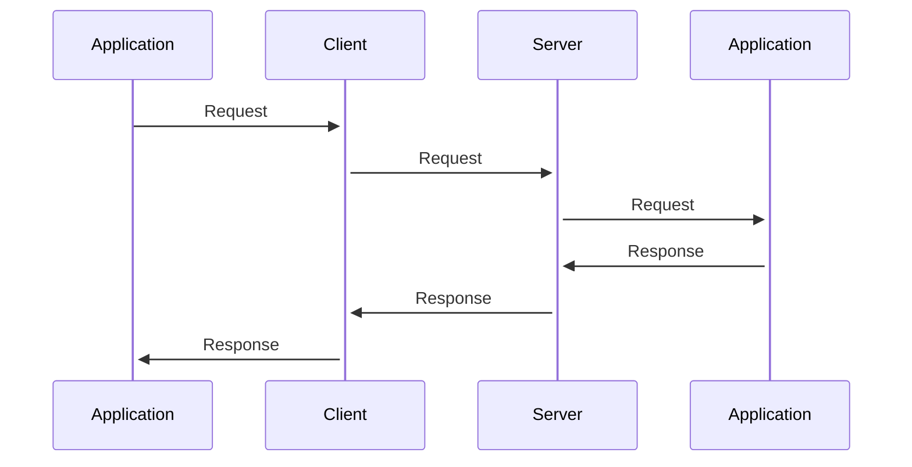
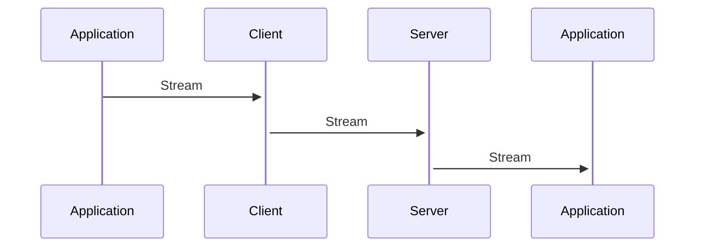

# Design Overview

This guide explains the high level design of `protocol-http` in the context of wider design patterns that can be used to implement HTTP clients and servers.

## Request/Response Model

The main model we support is the request/response model. A client sends a request to a server which return response. The protocol is responsible for serializing the request and response objects.

We provide an interface for request and response objects. This provides performance, predictability and robustness. This model has proven itself over several years, handling a variety of different use cases.

~~~ ruby
class Request
	attr :verb
	attr :target
	attr :headers
	attr :body
end

class Response
	attr :status
	attr :headers
	attr :body
end
~~~

One other advantage is that it's symmetrical between clients and servers with a clear mapping, i.e. the protocol is responsible for transiting requests from the client to the server, and responses from the server back to the client. This helps us separate and define request/response interfaces independently from protocol implementation.

### Client Design

A request/response model implies that you create a request and receive a response back. This maps to a normal function call where the request is the argument and the response is the returned value.

~~~ ruby
request = Request.new("GET", url)
response = client.call(request)

response.headers
response.read
~~~

## Stream Model

An alternative model is the stream model. This model is more suitable for WebSockets and other persistent bi-directional channels.

The interfaces for streaming can be implemented a bit differently, since a response is not returned but rather assigned to the stream, and the streaming occurs in the same execution context as the client or server handling the request.

~~~ ruby
class Stream
	# Request details.
	attr :verb
	attr :target
	attr :headers
	
	attr :response
	
	# Write the response and start streaming the output body.
	def respond(status, headers)
		response.status = status
		response.headers = headers
	end
	
	# Request body.
	attr_accessor :input
	
	# Response body.
	attr_accessor :output
	
	# Write to the response body.
	def write(...)
		@output.write(...)
	end
	
	# Read from the request body.
	def read
		@input.read
	end
end

class Response
	def initialize(verb, target)
		@input = Body::Writable.new
		@output = Body::Writable.new
	end
	
	attr_accessor :status
	attr_accessor :headers
	
	# Prepare a stream for making a request.
	def request(verb, target, headers)
		# Create a request stream suitable for writing into the buffered response:
		Stream.new(verb, target, headers, self, @input, @output)
	end
	
	# Write to the request body.
	def write(...)
		@input.write(...)
	end
	
	# Read from the response body.
	def read
		@output.read
	end
end
~~~

### Client Design

A stream model implies that you create a stream which contains both the request and response bodies. This maps to a normal function call where the argument is the stream and the returned value is ignored.

~~~ ruby
response = Response.new
stream = response.request("GET", url)

client.call(stream)

response.headers
response.read
~~~

## Differences

The request/response model has a symmetrical design which naturally uses the return value for the result of executing the request. The result encapsulates the behaviour of how to read the response status, headers and body. Because of that, streaming input and output becomes a function of the result object itself. As in:

~~~ ruby
def call(request)
	body = Body::Writable.new
	
	Fiber.schedule do
		while chunk = request.input.read
			body.write(chunk.reverse)
		end
	end
	
	return Response[200, headers, body]
end

input = Body::Writable.new
response = call(... body ...)

input.write("Hello World")
input.close
response.read -> "dlroW olleH"
~~~

The streaming model does not have the same symmetry, and instead opts for a uni-directional flow of information.

~~~ruby
def call(stream)
	stream.respond(200, headers)
	
	Fiber.schedule do
		while chunk = stream.read
			stream.write(chunk.reverse)
		end
	end
end

input = Body::Writable.new
response = Response.new(...input...)
call(response.stream)

input.write("Hello World")
input.close
response.read -> "dlroW olleH"
~~~

The value of this uni-directional flow is that it is natural for the stream to be taken out of the scope imposed by the nested `call(request)` model. However, the user must explicitly close the stream, since it's no longer scoped to the client and/or server.
